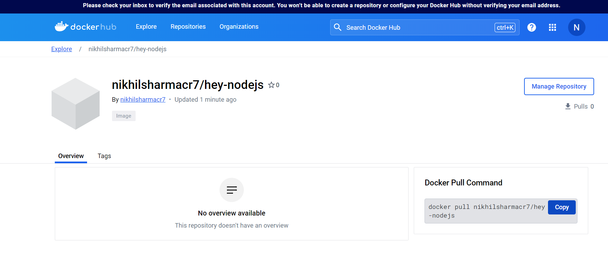
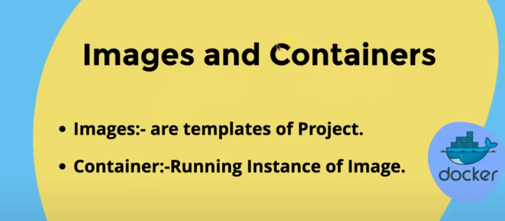
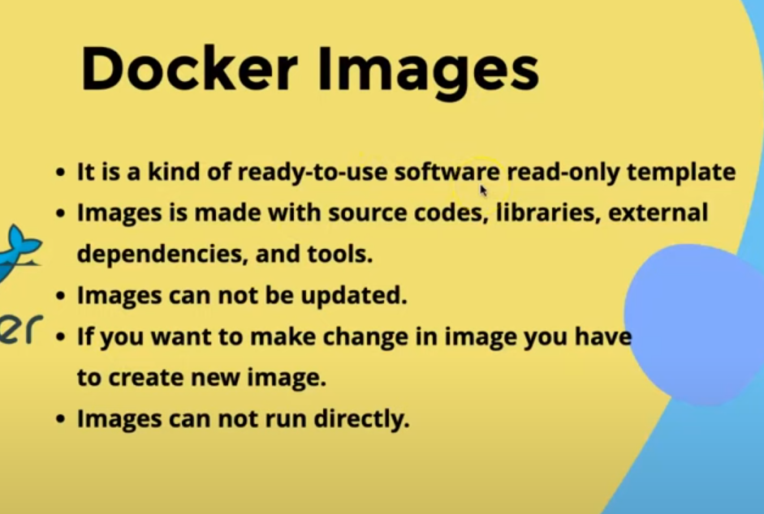
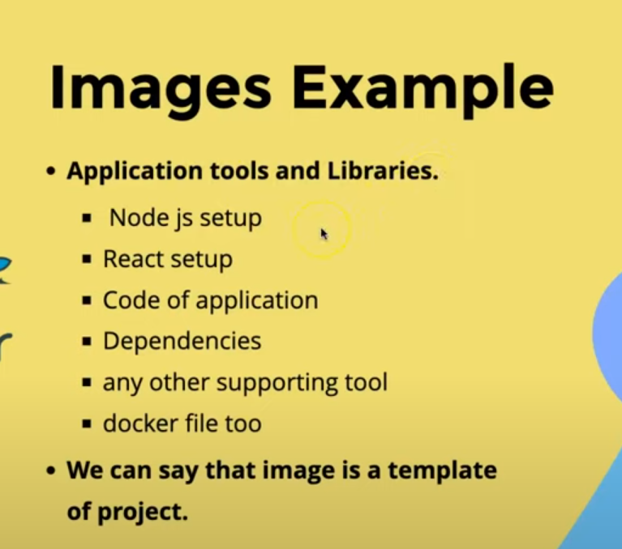
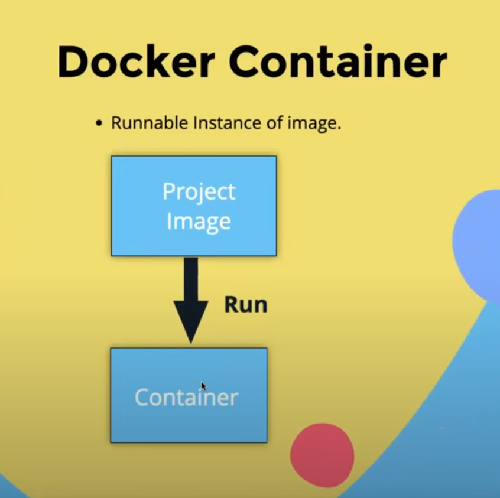
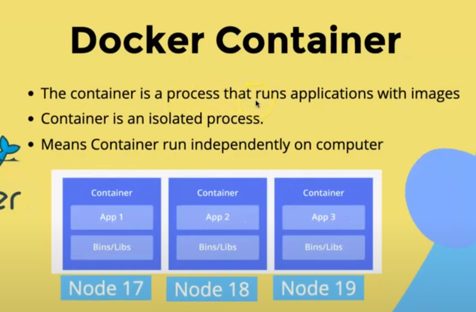

# WELCOME TO  DOCKER TUTORIAL LEARNINGS :-
 - dlt node_modules folder and make Dockerfile
 - using command  :-
   - docker build -t nikhilsharmacr7/hey-nodejs:0.0.1.RELEASE . created an image
 -  to run this image :-
   -  docker container run -d -p 3000:3000 nikhilsharmacr7/hey-nodejs:0.0.1.RELEASE
 - to check status :-
   - docker container ls
 - Its showing {"Hey":"Nodejs"} on localhost:3000 to stop the container
   - docker container stop 552
 
##  We were able to create a rest API at 1 point and was able to containerize it  
 - To make it public :-
   - docker push nikhilsharmacr7/hey-nodejs:0.0.1.RELEASE
  
  Anyone from copying this command can run this 
 - If we dlt this image from our docker then 
   -  docker pull nikhilsharmacr7/hey-nodejs:0.0.1.RELEASE
  
### Images And Container :-
 
 
 
 
 
 
### Base Image OR Parent Image :-

### Pull Image and Run Container :-

  - Using Command Line in CMD :-

  - or Using Docker Desktop :-

